# Madlib's Studio Gear, circa 2005

*Originally published on [r/Madlib](https://www.reddit.com/r/Madlib/comments/1siqjw4/most_of_madlibs_gear_circa_2005_personal_research/), April 2026.*

This page identifies the equipment in Madlib's home studio setup around 2005. The main sources are the photo book *Behind the Beat: Hip Hop Home Studios* (Gingko Press, 2005) and the Stones Throw special produced in 2005 by the Norwegian Broadcasting Corporation (NRK) for its music program *Lydverket*, supplemented by photographs from the Madvillainy sessions, magazine features and tour coverage.

## Samplers

The setup included not one but **two Boss SP-303** samplers: one placed on top of a Tascam CD player, and a second to the left of the **Akai MPC 4000**.

## Multitrack recorders

The studio held a large collection of the digital multitrack recorders of the period:

- **Akai DPS12**
- **Korg D1600** (MkI and MkII)
- **Roland VS-2000CD**
- **Fostex VF-16**
- **Tascam 2488**

The one analog exception is a cassette multitrack, the **Tascam Portastudio 488**, which already appears in earlier photographs from the Lootpack era.

## Photographs

<figure>
  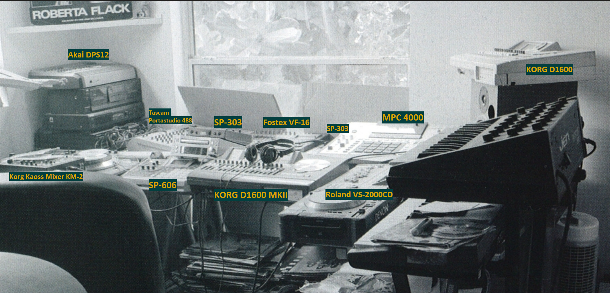
  <figcaption>Behind the Beat: Hip Hop Home Studios (2005)</figcaption>
</figure>

<figure>
  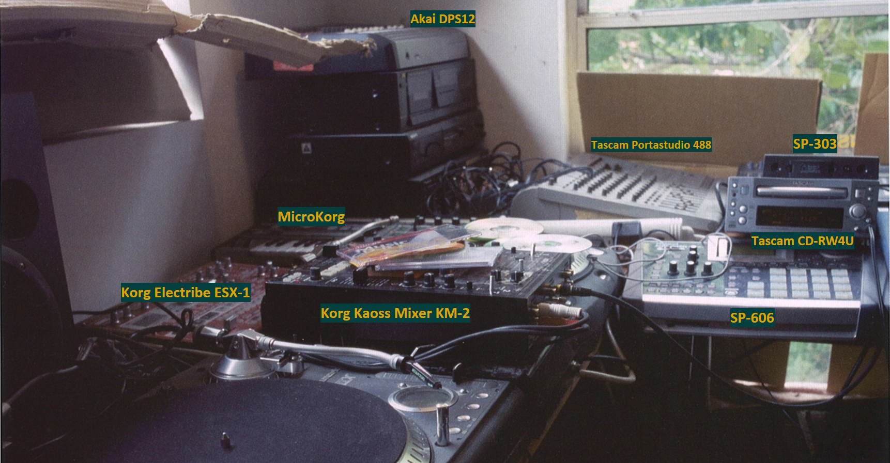
  <figcaption>Behind the Beat: Hip Hop Home Studios (2005)</figcaption>
</figure>

<figure>
  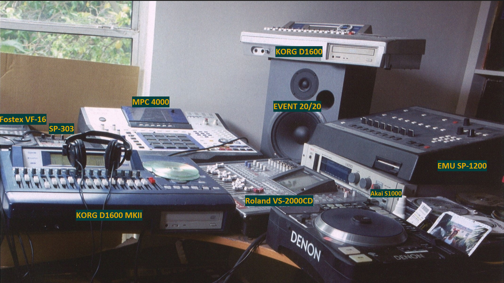
  <figcaption>Behind the Beat: Hip Hop Home Studios (2005)</figcaption>
</figure>

<figure>
  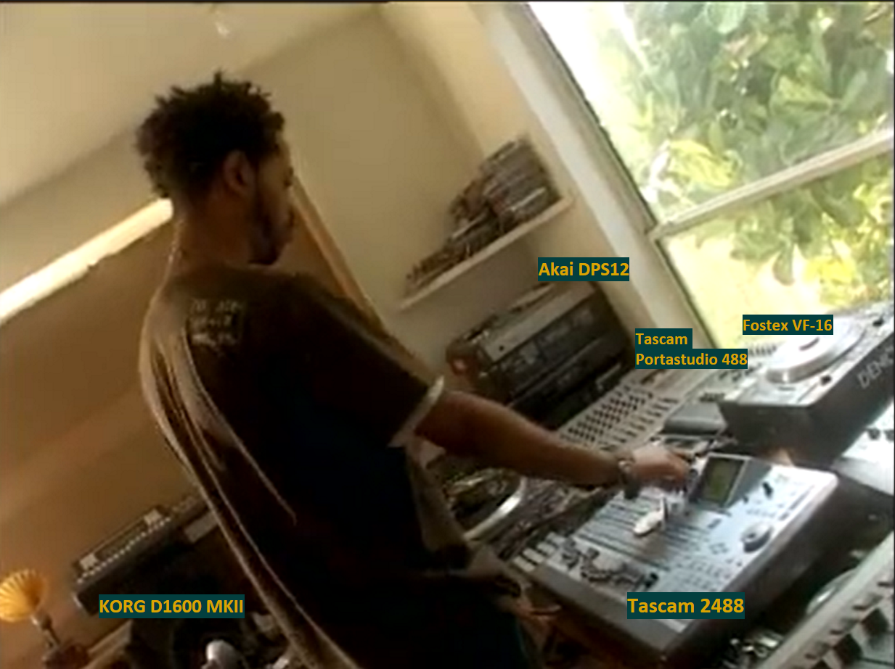
  <figcaption>Norwegian television’s Stones Throw special for Lydverket (NRK, 2005)</figcaption>
</figure>

<figure>
  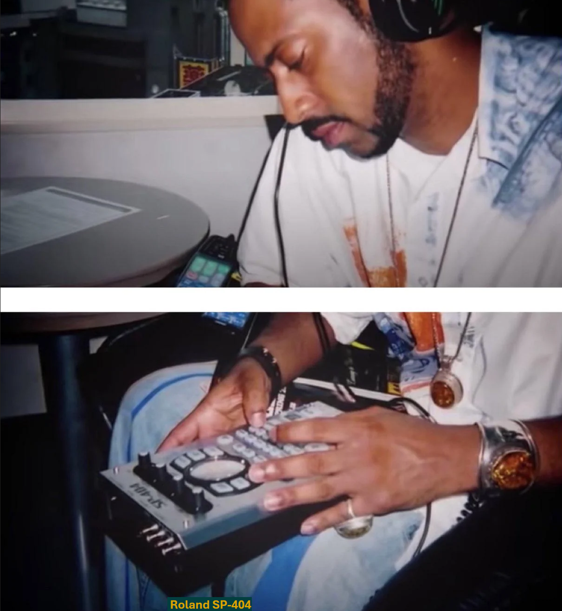
  <figcaption>2006 Chrome Children Tour or 2008 Japan tour with J. Rocc, Stones Throw Tour Blogs by Egon</figcaption>
</figure>

<figure>
  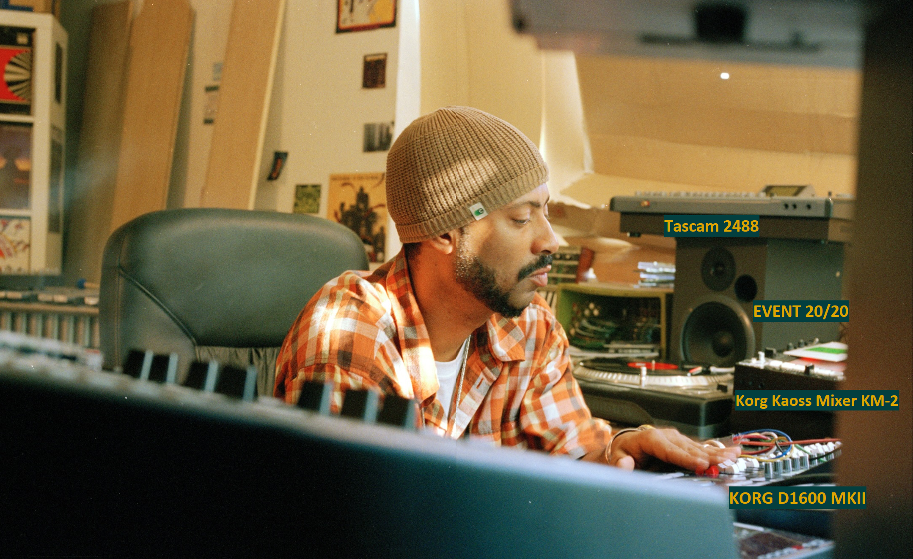
  <figcaption>Madlib’s home studio workspace in Los Angeles, California (circa 2004–2005)</figcaption>
</figure>

<figure>
  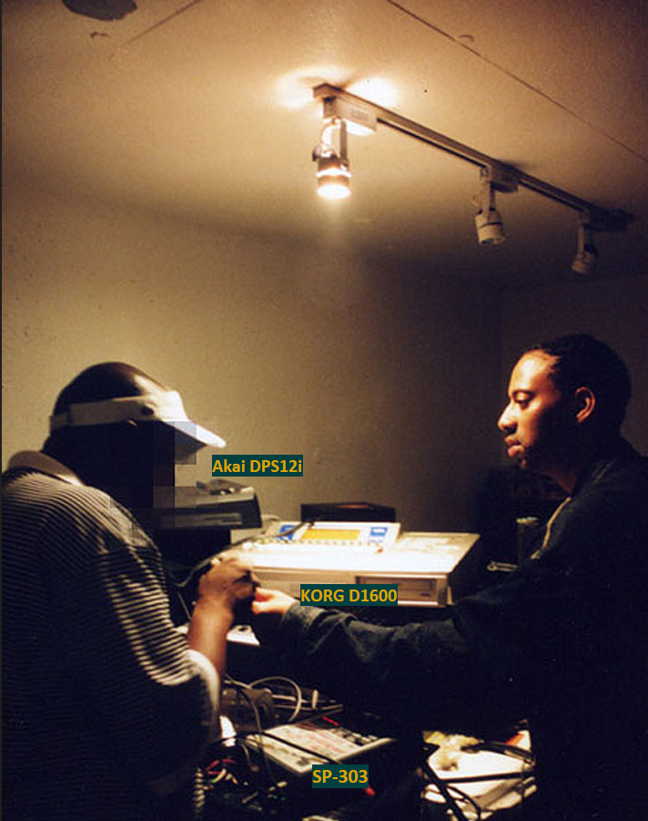
  <figcaption>Recording sessions for Madvillainy (circa 2002–2003)</figcaption>
</figure>

<figure>
  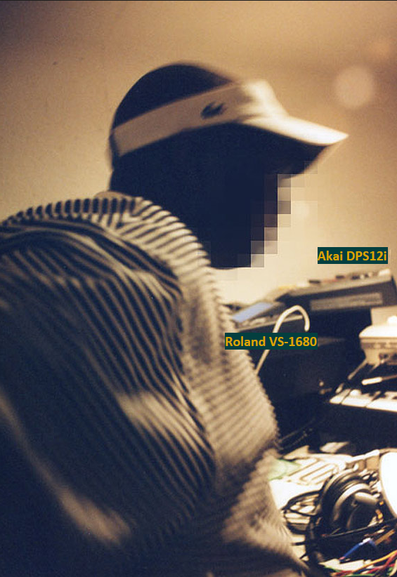
  <figcaption>Recording sessions for Madvillainy (circa 2002–2003)</figcaption>
</figure>

<figure>
  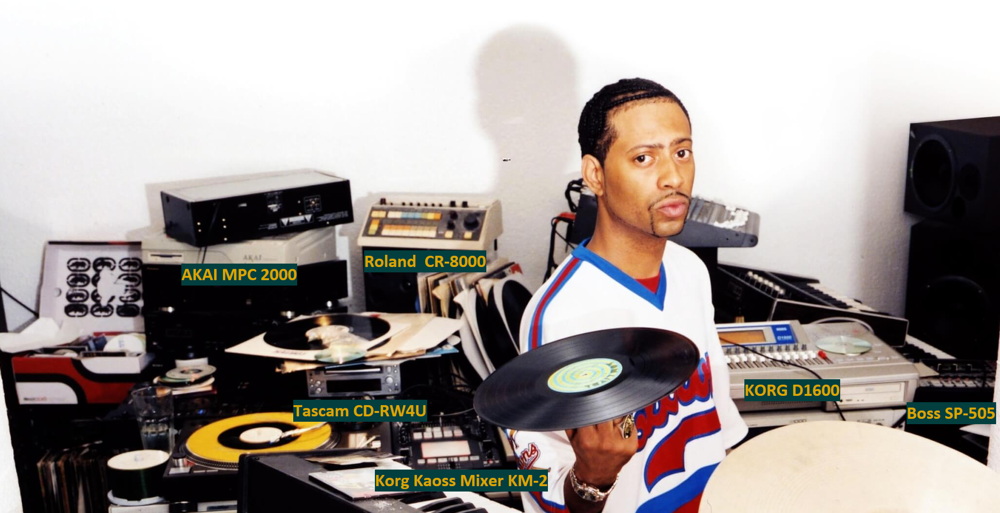
  <figcaption>2002–2003: Madlib in his home studio at the Stones Throw residence in Mount Washington (Los Angeles), during the era of Shades of Blue: Madlib Invades Blue Note (2003) and Yesterday&#x27;s New Quintet</figcaption>
</figure>

<figure>
  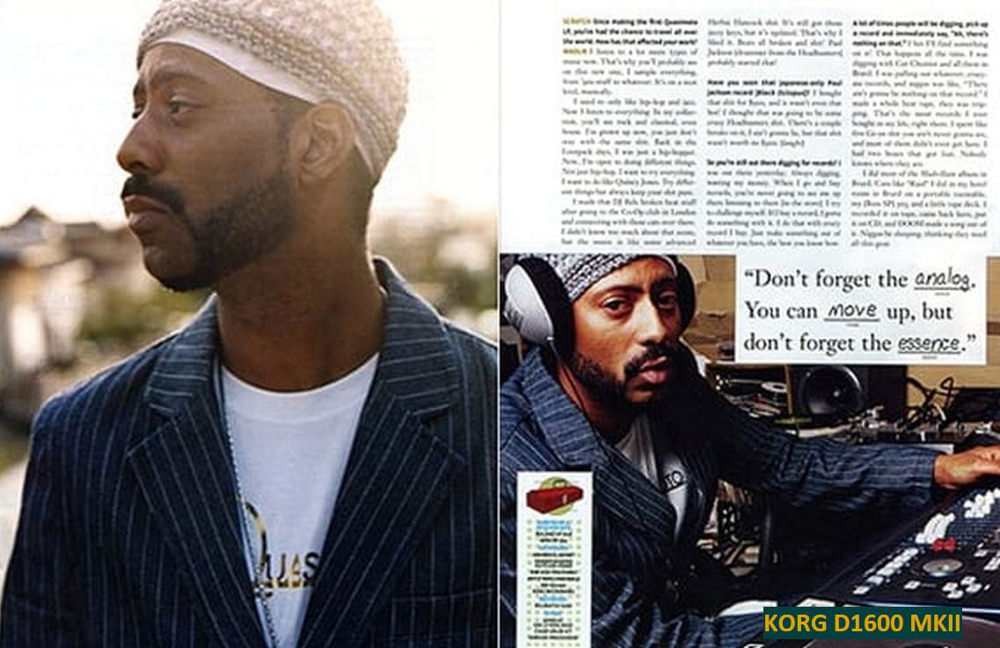
  <figcaption>Article “Mad Skills”, published in Scratch Magazine (May/June 2005 issue)</figcaption>
</figure>

<figure>
  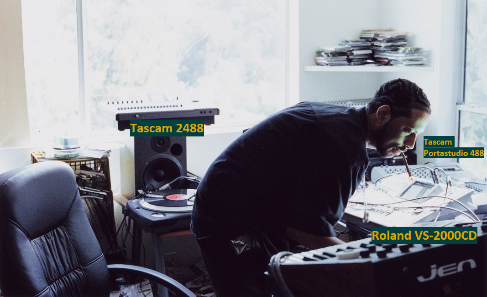
  <figcaption>Madlib’s home studio workspace in Los Angeles, California (circa 2004–2005)</figcaption>
</figure>

<figure>
  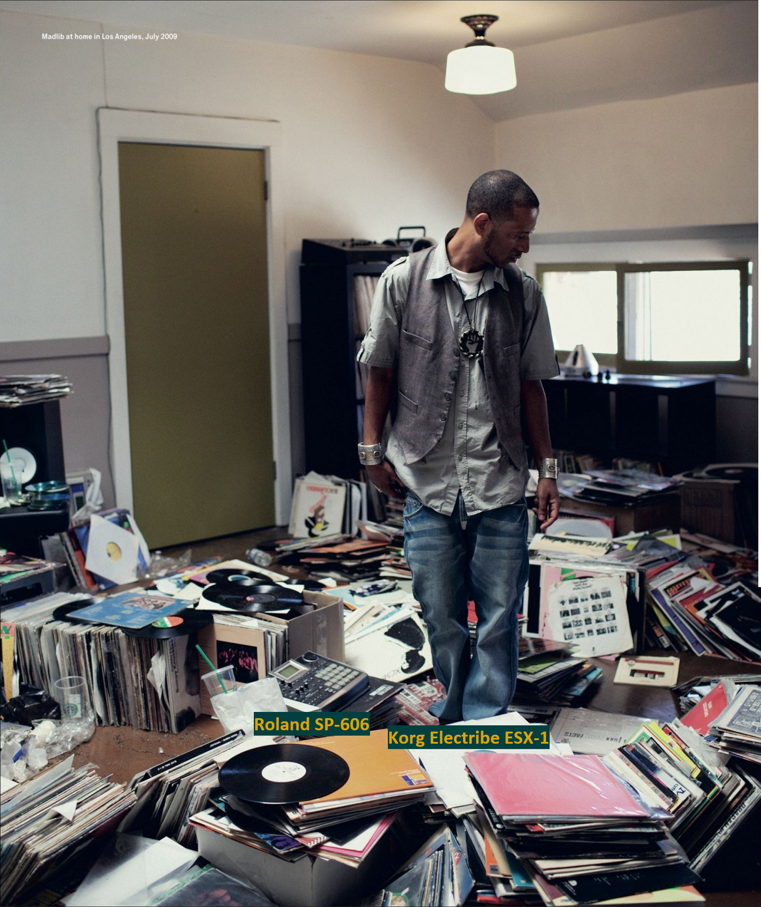
  <figcaption>An editorial portrait photographed in July 2009 during the lead-up to the 13-album Madlib Medicine Show series (2010–2011)</figcaption>
</figure>

<figure>
  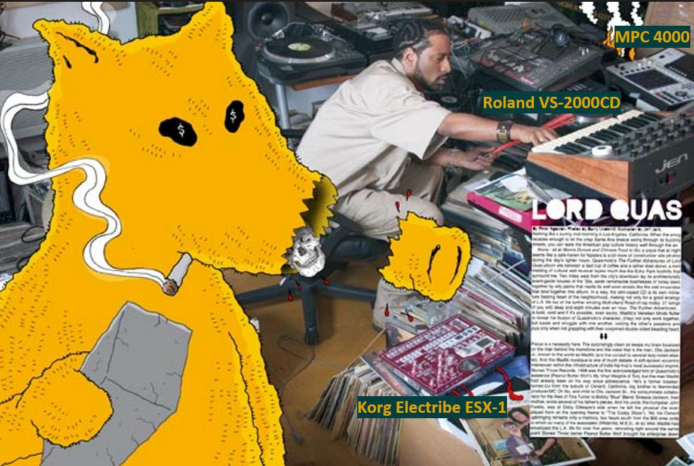
  <figcaption>Elemental Magazine – Issue #68 (published Summer / June 2005)</figcaption>
</figure>

---

<small>*Fair use notice: images on this page are included solely for educational and illustrative purposes under the fair use doctrine (17 U.S.C. § 107). All rights belong to their respective original owners.*</small>

[← Back to camplaix.github.io](https://camplaix.github.io/)
